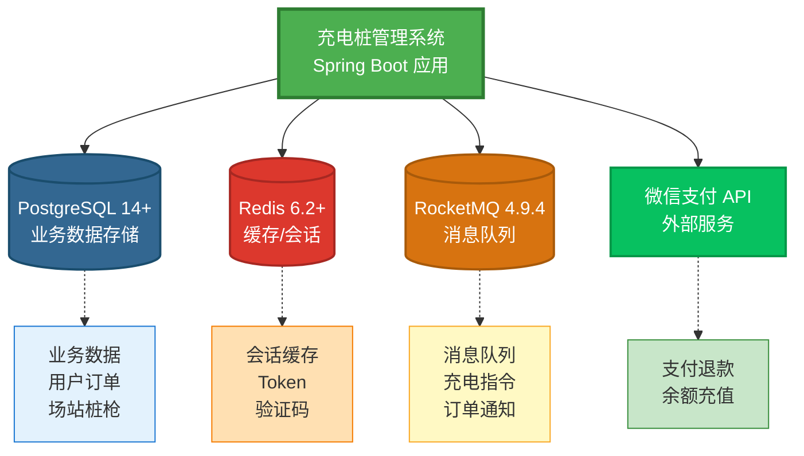
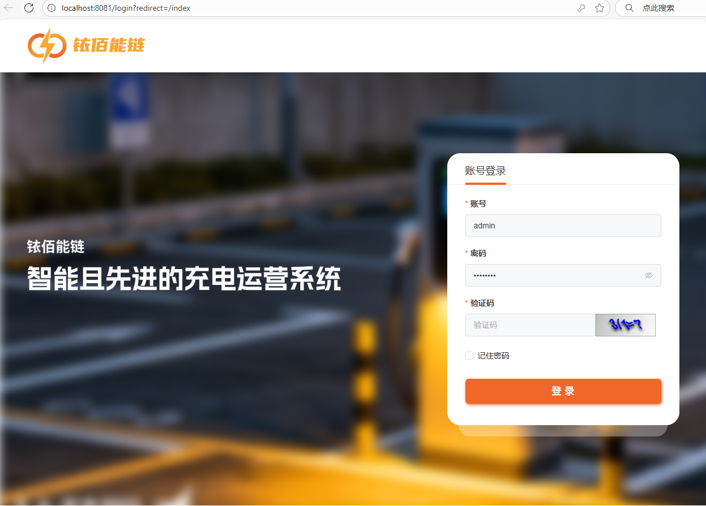

<p align="center"></img></p>
<p align="center" style="margin: 30px 0 30px; font-weight: bold;font-size: larger;">100Charge基于若依的充电运营平台</h1>
<p align="center">基于SpringBoot和若依框架开发</p>

<p align="center">
    <a href='https://gitee.com/ustcyc/100charge/stargazers'></img></a>
    <a href='https://gitee.com/ustcyc/100charge/members'></img></a>
</p>

# 一 项目背景

    我们团队在新能源充电领域深耕多年，深刻理解中小型充电场站在运营中面临的核心需求与实际痛点。为此，团队决定将多年积累的行业经验与技术成果开源，通过共享力量，帮助广大充电站站长降本增效，轻松应对日常运营挑战。同时也为准备进入该领域的创业者，提供一套经过实际验证过的解决方案，助力业务快速落地与商业验证。

## 1.项目价值

    针对中小充电站场站主 “数字化门槛高、落地周期长、技术门槛高” 的痛点，开源系统提供两大关键支撑：

* **快速接入充电桩**：无需技术开发即可轻松接入主流品牌充电桩，还可以实现设备数据轻松上传云端，降低场站数字化改造难度以及实施成本；
* **业务直达用户**：支持微信小程序端，让充电业务快速触达终端用户，用户可通过小程序完成找桩、预约、充电、支付全流程，助力场站主快速搭建线上服务渠道，提升用户体验与运营效率。
  
  

## 2.功能介绍

    **100Charge**充电运营系统以 “快速落地、轻松上云、轻量运营”为核心目标。系统具有四大核心功能模块，具体如下：

* **充电桩管理**：实现对充电桩设备的集中化管控，支持设备状态实时监控、远程参数配置，确保设备稳定运行，轻松管理。

* **场站管理**：覆盖场站基础信息维护、运营状态可视化展示，帮助场站主高效管理线下场地资源，提升场地利用效率。

* **计费策略**：提供灵活可配置的计费规则设置功能，支持按峰谷时段等多维度自定义计费方案，满足不同场景下的定价需求。

* **订单管理**：自动记录充电订单详情（如充电时长、电量、费用等），支持订单查询、统计与导出，实现充电业务流水的清晰化管理
  
  ## 

## 2.小程序截图

<div>


</div>

## 3.运营系统截图

### 3.1 社区版

### 3.2 商业版

# 二 版本对比

    我们提供两种版本，以满足不同阶段和规模的用户选择：

## 1.社区版

    如果您想快速推进业务落地，社区版是适合的选择，它包含的四项核心功能足以满足您的需求。社区版包含了稳定可靠的充电桩管理，计费策略，订单管理。助力您快速低成本开启充电场站运营。

## 2.商业版

    如果你要想要更精细化的运营与管理，商业版将是您的最佳选择。在**社区版**的基础上，额外提供了企业级的高阶运营功能，比如多维度的数据分析，营销工具等。并且提供官方技术保障与支持，满足复杂的商业场景。

## 3.功能对比

| 父模块  | 子模块     | 社区版 | 商业版 |
| ---- | ------- | --- | --- |
| 首页   | 首页      | √   | √   |
| 订单管理 | 订单管理    | √   | √   |
| 客户运营 | 个人用户    | √   | √   |
|      | 用户车辆    | √   | √   |
|      | 企业客户    | ×   | √   |
|      | 车队管理    | ×   | √   |
|      | 卡管理     | ×   | √   |
|      | 白名单管理   | ×   | √   |
| 场站运营 | 场站管理    | √   | √   |
|      | 充电桩管理   | √   | √   |
|      | 计费策略    | √   | √   |
| 财务管理 | 用户余额变动  | √   | √   |
|      | 企业余额变动  | ×   | √   |
|      | 结算单查询   | ×   | √   |
| 发票管理 | 发票管理  | ×  | √   |
| 营销活动 | 营销策略    | ×   | √   |
|      | 优惠券管理   | ×   | √   |
|      | 券使用记录   | ×   | √   |
| 运营商  | 运营商管理   | ×   | √   |
|      | 运营商分润管理 | ×   | √   |
| 运维管理 | 运维报表    | ×   | √   |
|      | 报文管理    | ×   | √   |
| 报表   | 账户充值明细   | √  | √   |
|      |  电站失败率报表   | √  | √   |
|      | 失败记录明细   | √   | √   |
|      | 多维度分析    | ×   | √   |
|      | 运营报表    | ×   | √   |
|      | 电站数据报表  | ×   | √   |
|      | 订单扣费明细  | ×   | √   |
|      | 账户信息汇总  | ×   | √   |
|      | 电站运营状况  | ×   | √   |
|      | 终端利用率   | ×   | √   |
|      | 企业收退款报表 | ×   | √   |
|      | 尖峰平谷统计  | ×   | √   |
|      | 车辆峰谷统计  | ×   | √   |
| 系统监控 | 系统监控  | √   | √   |


# 三 演示系统

|     | 地址   |用户名与密码|
| --- | ---- |----|
| 社区版 | https://demo-admin.100charge.cn:2080/ |admin <br> admin123|
| 商业版 | TODO |TODO |

# 四 开发环境

## 1 项目结构

```
100charge/
├─ charging-api/                    # 后端（多模块 Maven 聚合工程，业务与支撑服务）
│  ├─ pom.xml                       # 父 POM：统一依赖 & 版本管理 (Spring Boot 2.6.x, Java 8 -> 计划升级 21)
│  ├─ start.bat / start.sh          # 启动脚本（打包 & 运行封装）
│  ├─ sql/                          # 数据库初始化脚本
│  │  ├─ BaseAdminAPI.sql
│  │  └─ postgresql/                # 分步骤建库脚本（step1/step2）
│  ├─ xingchuan-admin/              # Admin 接口层模块（可能聚合管理端业务入口，Controller/接口适配）
│  ├─ xingchuan-framework/          # 框架核心：基础配置、通用组件（安全、异常、日志、序列化等）
│  ├─ xingchuan-system/             # 系统业务模块：用户、角色、权限、配置、认证集成等
│  ├─ xingchuan-quartz/             # 定时任务调度模块（Quartz 封装，任务定义 & 执行管理）
│  ├─ xingchuan-generator/          # 代码生成模块（基于 Velocity/模板生成 CRUD、前端页面等）
│  ├─ xingchuan-common/             # 通用工具类：POJO、枚举、工具方法、常量、通用响应封装
│  └─ target/                       # 编译输出（各子模块也有各自 target）
│
├─ charging-web/                    # Vue3 + Vite 管理后台前端
│  ├─ package.json                  # 前端依赖 (Vue3, ElementPlus, Pinia, Axios, ECharts)
│  ├─ vite.config.js                # Vite 构建配置（按环境区分 dev/staging/prod）
│  ├─ src/
│  │  ├─ main.js                    # 入口文件（注册全局组件、路由、状态）
│  │  ├─ App.vue
│  │  ├─ permission.js              # 路由权限守卫（token/role 校验）
│  │  ├─ systemConfig.js            # 系统常量或运行时配置
│  │  ├─ api/                       # 后端接口封装（Axios 封装、模块化 API）
│  │  ├─ assets/                    # 静态资源（样式、图片、图标）
│  │  ├─ components/                # 通用业务组件（表格、上传、富文本、选择器等）
│  │  ├─ directive/                 # 全局指令（权限指令、焦点指令等）
│  │  ├─ layout/                    # 主布局（侧边栏、头部、标签页容器）
│  │  ├─ plugins/                   # 插件注册（图标、富文本、SVG 等）
│  │  ├─ router/                    # 路由定义（动态菜单/权限路由）
│  │  ├─ store/                     # Pinia 状态（用户、菜单、设置）
│  │  ├─ utils/                     # 工具方法（请求封装、缓存、加解密）
│  │  └─ views/                     # 业务页面（用户管理、订单管理、统计报表等）
│  └─ public/                       # 公共静态资源
│
├─ charging-mini/                   # 微信/小程序 & H5 端（基于 uni-app）
│  ├─ package.json                  # 依赖 (uview-ui, echarts, md5 等)
│  ├─ pages.json / manifest.json    # 页面与应用配置（路由/窗口/运行时）
│  ├─ main.js                       # 入口初始化（全局组件 & 请求封装挂载）
│  ├─ App.vue
│  ├─ uni.scss / common.scss        # 全局样式/主题
│  ├─ components/                   # 复用组件（站点卡片、地图、搜索、优惠券等）
│  │  ├─ home-map/
│  │  ├─ home-station-card/
│  │  ├─ tabbar/
│  ├─ config/
│  │  ├─ api.js                     # 后端接口地址集中管理
│  │  ├─ request.js                 # 请求封装（拦截器、token 注入）
│  │  └─ md5Utils.js                # 加密/签名工具
│  ├─ pages/
│  │  ├─ index/                     # 首页/个人中心/启动页
│  │  ├─ login/                     # 登录流程（手机号/验证码/微信授权）
│  │  ├─ scan/                      # 扫码充电入口
│  │  ├─ stations/                  # 站点列表 & 地图模式
│  │  └─ wode/                      # 我的订单/账户/优惠券等
│  ├─ utils/                        # mixin、通用方法
│  ├─ wxcomponents/                 # 微信官方组件（隐私弹窗等）
│  └─ static/                       # 图片/脚本资源

```

# 六 安装部署

## 1. 依赖组件




## 2. 快速部署

项目提供简易部署命令，可供您快速部署，学习并使用。**请勿该部署方式应用于生产环境**，请按照以下顺序进行执行部署

### 1. 数据库

```bash
# 拉取镜像
docker pull docker.1ms.run/library/postgres:14-alpine
docker tag docker.1ms.run/library/postgres:14-alpine postgres:14-alpine

# 启动容器
docker run -d \
  --name charging-postgres \
  --restart always \
  -p 5432:5432 \
  -e POSTGRES_DB=charge \
  -e POSTGRES_USER=postgres \
  -e POSTGRES_PASSWORD=postgres \
  -e TZ=Asia/Shanghai \
  postgres:14-alpine


```

### 2. Redis

```bash
# 拉取镜像
docker pull docker.1ms.run/library/redis:6.2.21
docker tag docker.1ms.run/library/redis:6.2.21 redis:6.2.21

# 启动容器
docker run -d \
  --name charging-redis \
  --restart always \
  -p 6379:6379 \
  redis:6.2.21 \
  redis-server --appendonly yes
```

### 3. RocketMQ

```bash
# 创建网络
docker network create charging-net
# 拉取镜像
docker pull docker.1ms.run/xuchengen/rocketmq
docker tag docker.1ms.run/xuchengen/rocketmq xuchengen/rocketmq:latest

# 启动容器
docker run -itd \
 --name=rocketmq \
 --hostname rocketmq \
 --restart=always \
 -p 8080:8080 \
 -p 9876:9876 \
 -p 10909:10909 \
 -p 10911:10911 \
 -p 10912:10912 \
 -v /etc/localtime:/etc/localtime \
 -v /var/run/docker.sock:/var/run/docker.sock \
 --net=host \
 xuchengen/rocketmq:latest
```

## 3. 数据库初始化

- `charging-api/sql/postgresql/step1-basic.sql` - 基础表结构

- `charging-api/sql/postgresql/step2-setKey.sql` - 主键和索引

## 4. 项目配置

### 1. 后端服务配置
#### API端口

```yaml
# charging-api/application.yml
server:
  # 服务器的HTTP端口，默认为8080
  port: 8080
  servlet:
    # 应用的访问路径
    context-path: /
```

#### 数据库配置

```yaml
# charging-api/application-dev.yml
spring:
  datasource:
    druid:
      master:
        url: jdbc:postgresql://[服务器IP]:5432/charge
        username: postgres
        password: postgres
```

#### Redis配置

```yaml
# charging-api/application-dev.yml
spring:
  redis:
    host: 服务器IP
    port: 6379
    database: 0
    password: ""
    timeout: 10s
```

#### RocketMQ配置

```yaml
# charging-api/application-dev.yml
rocketmq:
  name-server: 服务器IP:9876
  topic: Charging
  tags:
    control: Control
    order-bill: OrderBill
  groups:
    invoice: PlatformInvoiceGroup1
  producer:
    group: ProducerGroup1
```

### 2. 运营平台配置

如何运行Web运营平台，请参考charging-README,[点击查看](./charging-web/README.md "README")

```json
// charging-web/vite.config.js
    server: {
      port: 8081,
      host: true,
      open: true,
      proxy: {
        "/dev-api": {
          target: "http://127.0.0.1:8080/", // API接口地址
          changeOrigin: true,
          rewrite: (p) => p.replace(/^\/dev-api/, ""),
        },
      },
    },
```


### 3. 小程序以及微信支付配置(可选)

```yaml
# charging-api/application-dev.yml
# 微信小程序
wx:
  miniapp:
    configs:
      #微信小程序的appid
      - appid: appid
        #微信小程序的Secret
        secret: secret
        #微信小程序消息服务器配置的token
        token:
        #微信小程序消息服务器配置的EncodingAESKey
        aesKey:
        msgDataFormat: JSON
        # 小程序版本
        envVersion: "trial"
        # 跳转地址
        page: /pages/index/home
        # 启动充电提示模板
        startChargingNotificationTemplate: w
        # 停止充电提示模板
        stopChargingNotificationTemplate: x
        # sendMessage 发送订阅消息 POST
        wxSendMessageUrl: https://api.weixin.qq.com/cgi-bin/message/subscribe/send?access_token=%s

# 微信支付
pay:
  wechat:
    appId: 123456789
    secret: 123456789
    merchantId: 1715546065
    privateKeyPath: ./apiclient_key.pem
    merchantSerialNumber: 123456789
    apiV3key: 123456789
    profitSharing: false
    expireMinute: 5
    rechargeNotifyUrl: https://您的服务器IP/prod-api/payNotify/recharge/wechat/ #这里是回调服务器地址
    refundNotifyUrl: https://您的服务器IP/prod-api/payNotify/recharge/wechat/   #这里是回调服务器地址
    httpProxyEnabled: true
    httpProxyHost: 127.0.0.1
    httpProxyPort: 8213
    readTimeoutMs: 5000
    connectTimeoutMs: 5000
    writeTimeoutMs: 5000
```

### 4. 本地运行

本地启动api服务以及Web运营平台,使用测试账号：

```
账号：admin
密码：admin123
```



# 七 版权须知

    本软件项目（包括但不限于源代码、文档、图片、配置等所有构成项目的材料）的原始版权和知识产权归 **[山东行川新能源科技有限公司]** 所有。我们保留对本项目名称、品牌、Logo、专利以及商业许可的所有权利。未经明确授权，任何个人或组织不得使用与本项目相关的名称、标识进行商业性宣传或推广。


# 八 贡献代码

## 1. 如何提交代码

    良好的团队协作的前提是，有一个清晰的代码规范，便于其他人理解。在您提交代码前，请您熟悉[《阿里巴巴Java开发手册》](https://developer.aliyun.com/ebook/386)的代码规范

## 2. 如何提交缺陷反馈

* 您已搜索过现有Issues，确保没有重复问题

* 您已确认这不是我本地环境导致的问题

* 您已提供足够的信息供开发人员复现问题

* 提交时，您已正确选择标签：bug

## 3. 如何提交需求

* 您已搜索过现有需求，确保没有重复需求

* 我已详细描述需求的背景，如我作为一个运营人员，我想要看到每日订单高峰时间段，并在该时间设置合适的价格。

* 我理解开源团队资源有限，会耐心等待评估

* 提交时，您已正确选择标签：feature

# 九 开源协议

    **100Charge**是基于 [AGPL](https://www.gnu.org/licenses/agpl-3.0.en.html) 和 [XCPL](./LICENSE) 双协议的开源软件。您在使用、修改、复制、分发本项目时，仔细阅读并理解以下该协议条款。

**如果您属于以下情况，请遵循[AGPL](https://www.gnu.org/licenses/agpl-3.0.en.html)协议**

* 您是**个人开发者、研究机构或教育机构**，希望技术学习、研究或非商业性地使用本项目。
* 您希望基于本项目进行**修改或扩展，并愿意将您的修改成果同样开源**给社区。

如果您是学生或者教师，用于技术学习或教学目的，可联系我们，我们将免费提供培训与指导（远程）


**如果您属于以下情况，需要获得[XCPL](./LICENSE)协议许可**

* 您基于本项目的修改版本**用于商业目的，但不希望公开您的项目代码**。

* 您在一个**内部使用的系统**中集成了本项目，只对组织内部使用，**不**打算将其对外提供服务。

* 您计划将本项目**打包成SaaS产品或云服务进行销售**。

* 您需要在**专有/闭源产品中集成、修改或链接**本项目的代码。

* 您需要自行部署系统并运营，对外部用户提供收费服务。

**如何获得[XCPL](./LICENSE)协议许可？**

    您需要通过官方渠道，包括不限于：微信、QQ群等与我们取得联系，这样确保您秉持开源精神同时，获得商业许可的自由，并能得到我们官方的技术支持


# 十 联系我们

**QQ群**，如果您只是技术学习与咨询等，请加入我们的**QQ群**：766266573，入群请填写：100+姓名


**微信扫码**，如果您要想咨询我们的商业授权，以及培训等事宜，请优先加微信，请备注：100+姓名


