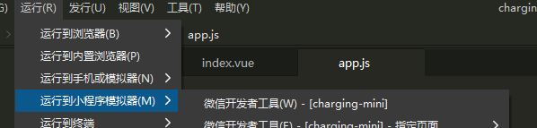
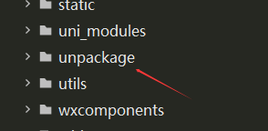

# 100Charge充电小程序

这是一个基于 uni-app 开发的电动汽车充电桩查找和充电管理小程序。

## 功能特性

### 🏠 首页 (pages/index/index.vue)
- **搜索功能**: 搜索附近充电桩
- **促销横幅**: 展示充电优惠信息
- **筛选排序**: 按距离、价格、评分等条件筛选
- **充电站列表**: 显示附近充电站详细信息
- **快速导航**: 一键导航到充电站

### 📱 扫码充电 (pages/scan/scan.vue)
- **二维码扫描**: 扫描充电桩二维码
- **手动输入**: 手动输入充电桩编号
- **充电启动**: 快速启动充电流程

### 😊 个人中心  (pages/profile/profile.vue)
- **用户信息**: 显示用户基本信息和统计数据
- **充电记录**: 查看历史充电记录
- **钱包管理**: 账户余额和充值
- **车辆管理**: 管理绑定车辆信息
- **收藏站点**: 收藏常用充电站
- **优惠券**: 查看和使用优惠券
- **设置**: 应用设置和帮助

### ⚡ 充电详情 (pages/charging/charging.vue)
- **充电桩信息**: 显示充电桩详细参数
- **充电控制**: 开始、停止、暂停充电
- **实时监控**: 充电进度和费用实时显示
- **充电设置**: 设置目标电量和充电模式

## 技术栈

- **框架**: uni-app
- **语言**: Vue.js + JavaScript + uview-ui
- **样式**: CSS3 + Flexbox/Grid
- **平台**: 微信小程序

## 项目结构

```
zhitai/
├── pages/                 # 页面目录
│   ├── index/            # 首页
│   ├── scan/             # 扫码页面
│   ├── profile/          # 个人中心
│   └── charging/         # 充电详情
├── static/               # 静态资源
│   ├── js/app.js        # 配置
├── pages.json           # 页面配置
├── manifest.json        # 应用配置
├── main.js              # 入口文件
└── App.vue              # 应用组件
```

## 开发环境配置
1. 在微信公众平台注册小程序
2. 在项目中配置小程序 AppID
3. 将您的微信设置为小程序开发者
4. 安装 HBuilderX
5. 导入项目

5.1 uview-ui插件安装，请参考：[uview-ui](https://www.uviewui.com/components/install.html)

5.2 uview-ui依赖：
``` shell
// 安装sass
npm i sass -D
 
// 安装sass-loader
npm i sass-loader -D
```
6. 选择运行平台（微信开发者工具）

``` shell
运行->运行到小程序模拟器->微信开发者工具
```


6.1 如遇无法调启微信开发者工具或其他情况，请选择手动导入到微信开发者工具



## 注意事项

1. 本项目为演示版本，部分功能需要后端API支持
2. 扫码功能需要在实际设备上测试
3. 地图功能需要配置相应的地图服务
4. 支付功能需要配置支付接口

## 联系方式

如有问题或建议，请联系开发团队。

---

© 2024 100Charge充电. All rights reserved. 